# Doodle to Search: Practical Zero-Shot Sketch-based Image Retrieval

[PyTorch](https://pytorch.org/) | [Arxiv](https://arxiv.org/abs/1904.03451)

<p align="center">

</p>

PyTorch implementation of our D2S model for zero-shot sketch-based image retrieval:  
[Doodle to Search: Practical Zero-Shot Sketch-based Image Retrieval](https://arxiv.org/abs/1904.03451)  
[Sounak Dey](http://www.cvc.uab.es/people/sdey/), [Pau Riba](http://www.cvc.uab.es/people/priba/), [Anjan Dutta](https://sites.google.com/site/2adutta/home), [Josep Llados](http://www.cvc.uab.es/~josep/) and [Yi-Zhe Song](http://personal.ee.surrey.ac.uk/Personal/Y.Song/)  
[CVPR, 2019](http://cvpr2019.thecvf.com/)

## Retrieval Results

#### Sketchy

<p align="center">
 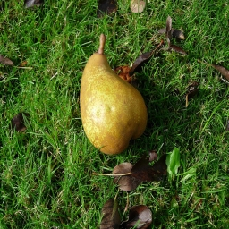   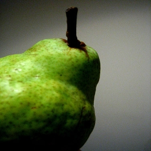 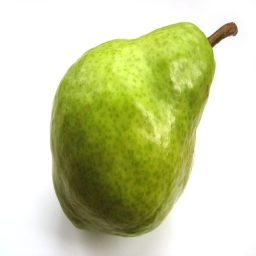 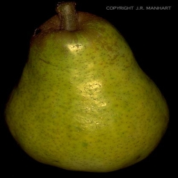     <br>
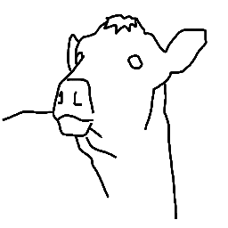 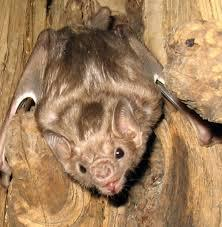 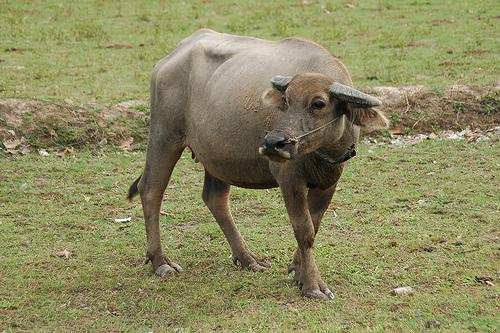 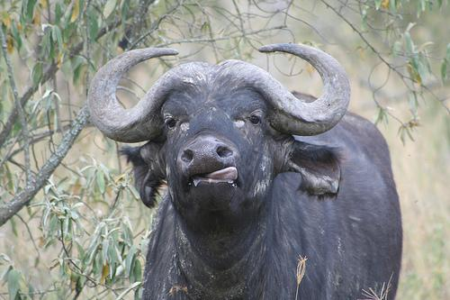 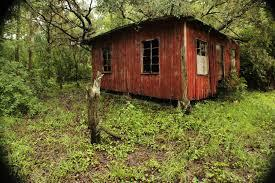 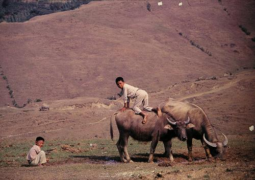 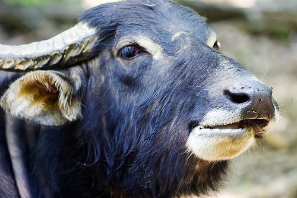 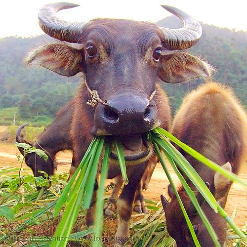 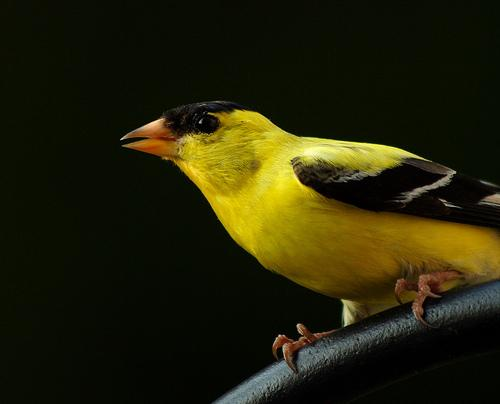 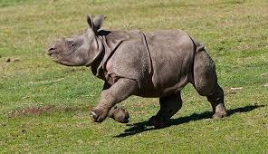 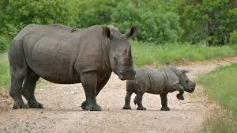 <br>
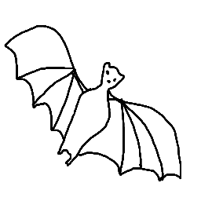 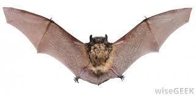 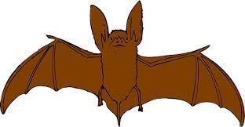 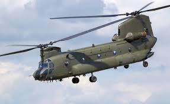  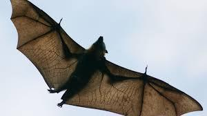 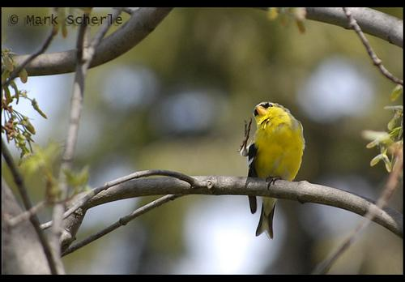 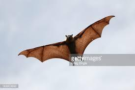 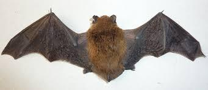 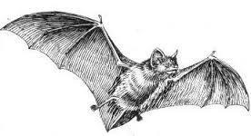 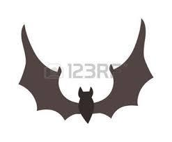 <br>
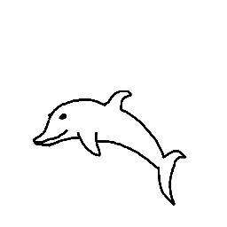 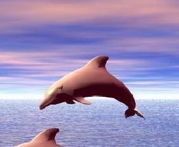 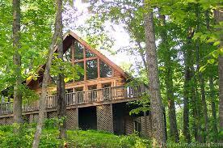 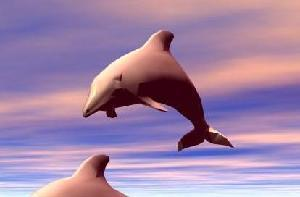 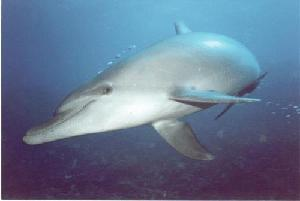 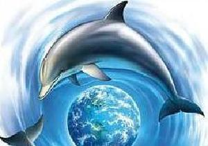 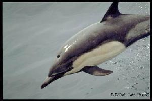 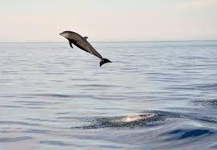 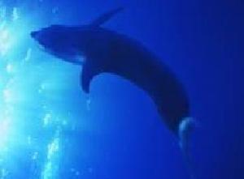 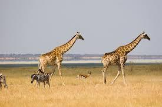 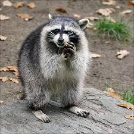 <br>
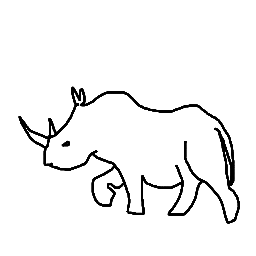 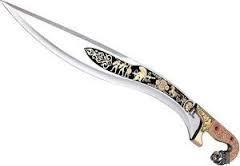 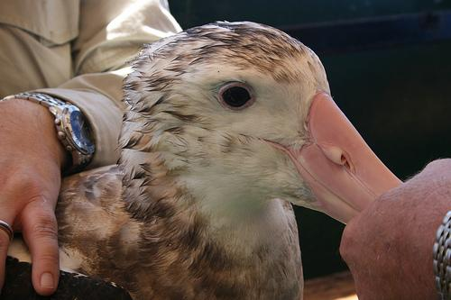 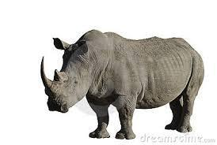 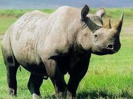 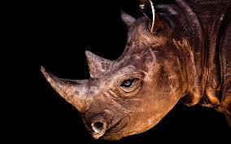 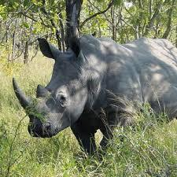 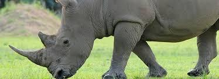 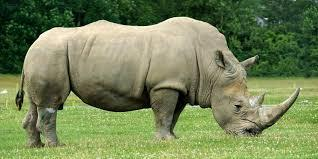 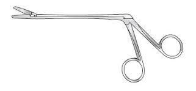 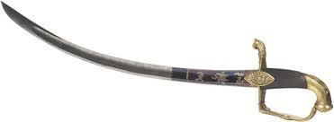 <br>
</p>

#### TU-Berlin
        
<p align="center">
           <br>
           <br>
           <br>
           <br>
           <br>
</p>

#### QuickDraw
        
<p align="center">
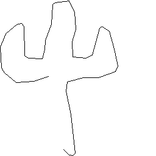  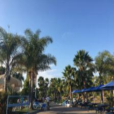  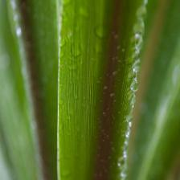       <br>
           <br>
           <br>
           <br>
           <br>
</p>

## Prerequisites

* Linux (tested on Ubuntu 16.04)
* NVIDIA GPU + CUDA CuDNN
* 7z 
```bash
sudo apt-get install p7zip-full
```
## Getting Started
### Introduction 
We took the first steps to move towards practical zero shot sketch based image retrieval systems (see the paper for more detail). 
To this end, we have used [Quick Draw!](https://github.com/googlecreativelab/quickdraw-dataset) 
to curate the sketches and for the images we would like to thanks [Flickr API](https://www.flickr.com/services/api/) for such an amazing API.

The structure of this repo is as follows:
1. Installation
2. Getting the data 
3. How to train models 
4. At last how to test and evaluate

### Installation
* Clone this repository
```bash
git clone https://github.com/sounakdey/doodle2search.git
cd doodle2search
```
* Install the requirements (not checked)
```bash
pip3 install -r requirements.txt
```
### Download datasets
* Sketchy
* TU-Berlin
```bash
bash download_datasets.sh
```
* QuickDraw-Extended [sketches](http://datasets.cvc.uab.es/QuickDraw/QuickDraw_sketches_final.zip) and [images](http://datasets.cvc.uab.es/QuickDraw/QuickDraw_images_final.zip)

### Train
Finally we are ready to train. Magical words are:
```bash
python3 src/train.py sketchy_extended --data_path <mention the data path of the dataset>
```
The first argument is the dataset name, which you can replace it with tuberlin_extend or quickdraw_extend.
You can check the ``options.py`` for changing a lot of the options such dimension size, different models, hyperparameters, etc.

### Test
##### Sketchy
```bash
python3 src/test.py sketchy_extend --data_path <mention the data path of the dataset> --load <path of the trained models>
```

### Citation
```
@inproceedings{Dey2019Doodle,
author = {Sounak Dey, Pau Riba, Anjan Dutta, Josep LLados and Yi-Zhe Song},
title = {Doodle to Search: Practical Zero-Shot Sketch-based Image Retrieval},
booktitle = {Proceedings of the IEEE conference on computer vision and pattern recognition.},
year = {2019}
}
```
## Conclusion
Thank you and sorry for the bugs!

## Author
* [Sounak Dey](http://www.cvc.uab.es/people/sdey/) ([@SounakDey](https://github.com/sounakdey))
* [Pau Riba](http://www.cvc.uab.es/people/priba/) ([@PauRiba](https://github.com/priba))
* [Anjan Dutta](https://sites.google.com/site/2adutta/home/) ([@AnjanDutta](https://github.com/AnjanDutta))
